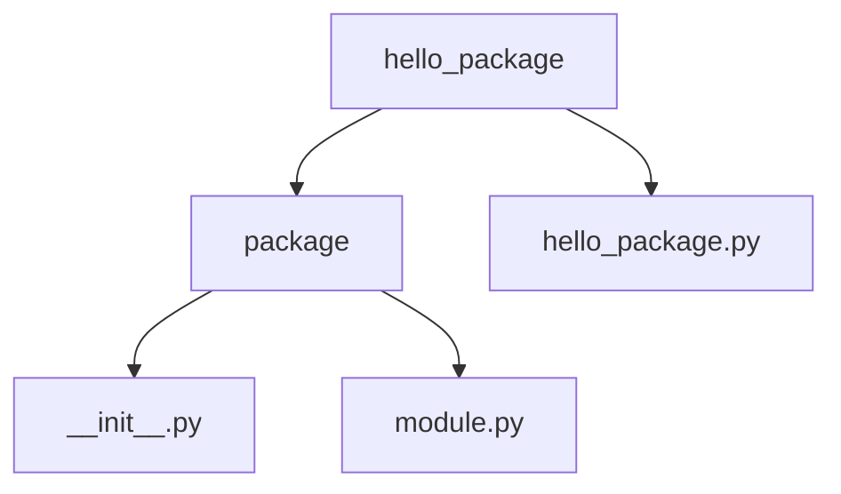

# Hello Package
#### Create your package and push to PyPi Guide

## Preparation
#### 1. Register Yourself  
If you want to make your package publicly accessible you can upload it on PyPi. So, first of all, register yourself on PyPi: https://pypi.org/account/register/.
#### 2. Checking Required Tools  
Install the required packages:  
**Setuptools:** Setuptools is a package development process library designed for creating and distributing Python packages.
**Wheel:** The Wheel package provides a bdist_wheel command for setuptools. It creates .whl file which is directly installable through the pip install command. We'll then upload the same file to pypi.org.  
**Twine:** The Twine package provides a secure, authenticated, and verified connection between your system and PyPi over HTTPS.
**Tqdm:** This is a smart progress meter used internally by Twine.
```bash
python -m pip install --upgrade pip setuptools wheel
python -m pip install tqdm
python -m pip install --user --upgrade twine
```  
## Project Structure
